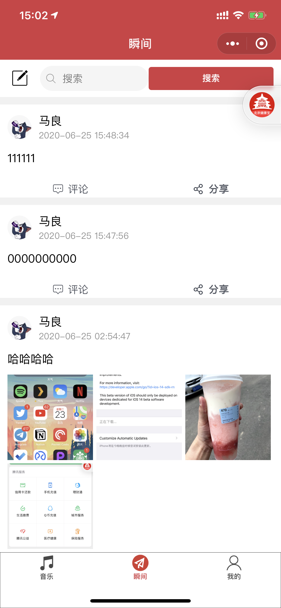
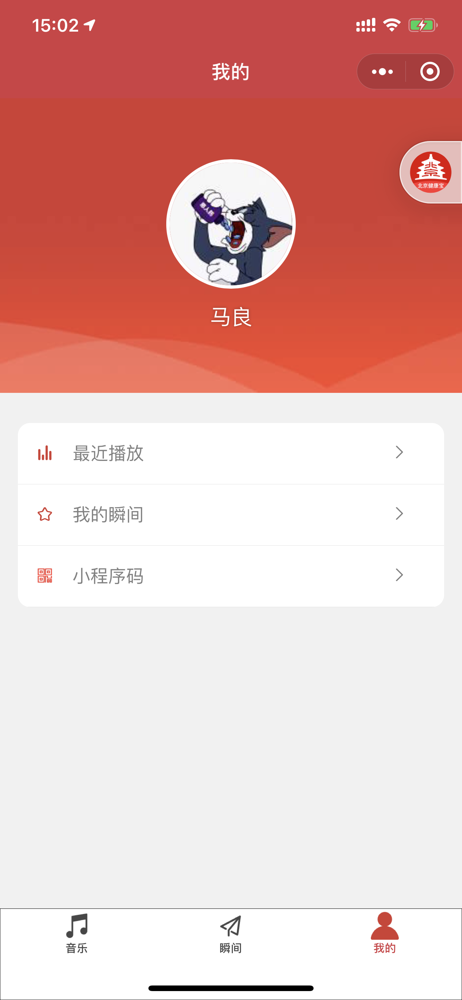
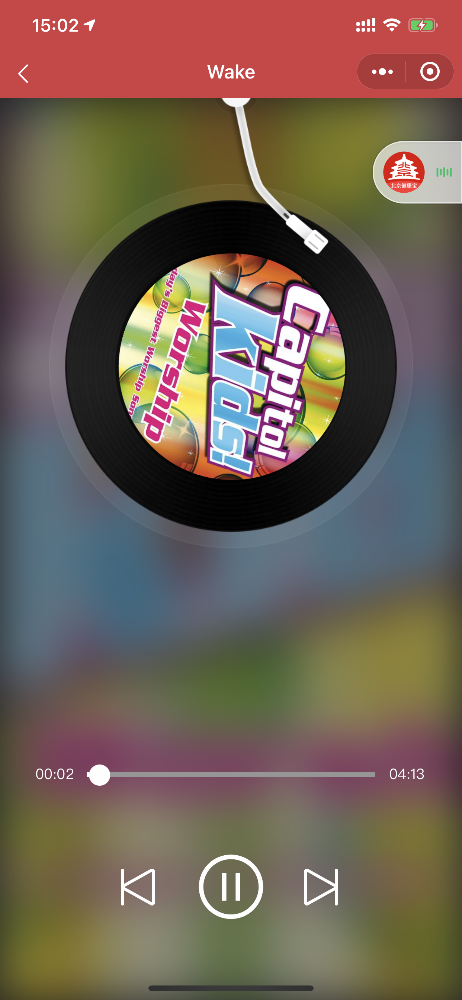
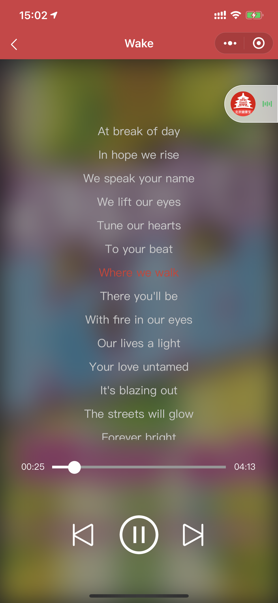
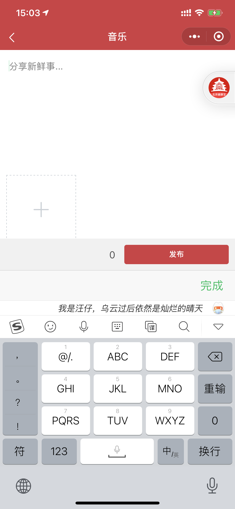

# Ease Music

> 云音乐+朋友圈

## 运行环境

小程序开通云开发权限

## 部署

1. 修改 appid

```json
// project.config.json
{
    ...

    "appid": "替换成你自己的"

    ...
}
```

2. 部署云函数

部署 cloudfunctions 目录中所有云函数，其中 `getPlaylist` 需要设置触发器定时运行，开发者工具中右键该文件夹，选择 `上传触发器`

## 预览图

<center style="font-size:14px;color:#C0C0C0;text-decoration:underline">首页</center>


<center style="font-size:14px;color:#C0C0C0;text-decoration:underline">瞬间</center>



<center style="font-size:14px;color:#C0C0C0;text-decoration:underline">我的</center>



<center style="font-size:14px;color:#C0C0C0;text-decoration:underline">播放</center>



<center style="font-size:14px;color:#C0C0C0;text-decoration:underline">歌词</center>



<center style="font-size:14px;color:#C0C0C0;text-decoration:underline">发布瞬间</center>


